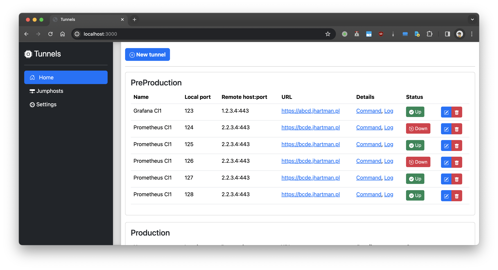

# go-tunnels-manager

A tool to manage SSH tunnels.

This mini-project is my learning playground to get more experiences with Golang, HTMLX and Bootstrap.

Very early "Work in progress"...

#

# References

 * HTMX
 * Bootstrap 5
 * Air (auto-reload of Go app)
 * go-chi
